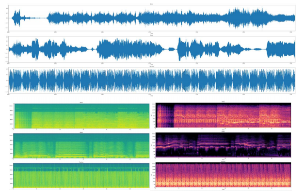

# Development of a Convolutional Neural Network for multilabel auto tagging of music audio files

## Introduction 

In general, music audio files can be accompanied by metadata related to their content such as free text description or tags. Tags are proved to be more useful as they provide a more direct description of the audio file and can be used in tasks such as classification per gender, artist, musical instrument etc in recommendation systems related to music. As not all audio files are accompanied by tags, the need of auto-tagging arises.

One approach widely used involves the usage of unsupervised feature learning such as K-means, sparse coding and Boltzmann machines. In these cases, the main concern is the capture of low leve music structures that can be used as input into some classifier. 

Another approach involves supervised methods, like Deep Neural Networks (DNNs) of various architecural types (MLP, CNN, RNN), that directly map labels to audio files. In these cases, the feature extraction method could vary a lot, from spectograms to hand-engineered features like Mel Frequency Cepstral Coefficients (MFCCs).

In more detail, a spectrogram if an audio clip is a visua represetation of its spectrum of frequencies as they vary with time. A common variation is the mel spectrogram, where the so-called mel scale, i.e. a perceptual scale of pitches judged by listenes to be equal in distance from one another, is used. Aditionally, MFCCs are coefficients that collectively make up a Mel Frequency Cepstrum (MFC), which is a representation of the short-term power spectrum of a asound, based on a linear cosine transform of a log power spectrum on a nonlinear mel scale of frequency. 

For the purpose of this project, the method that was deployed involves the transformation of the initial sound files into 2D numerical matrices using both feature extraction techniques (mel spectrograms, MFCCs). These matrices were then fed into  a CNN in order to assign suitable tags to each audio clip. Multiple architectures, from shallow to deeper, were evaluated. 

## The dataset 
Among many candidates, the one finally selected was the MagnaTagATune dataset which can be found [here](http://mirg.city.ac.uk/codeapps/the-magnatagatune-dataset). The dataset consists of almost 26000 audio tracks of 29 seconds in mp3 format with 32 mbps, where the 188 available binary tags are not mutually exclusive (i.e. a file can be labelled with more than one tag). The dataset was preferred among all others, since:

- All clips have exaclty the same duration 
- All tags are organized in a matrix format with reference to each clip via a unique clip id
- This dataset has already been used successfully in many academic publications
- The dataset is free of copyright protection (DRM licensing) as part of the magnatune music collection

The available tags include, among others music genres (e.g. "pop", "alternative", "indie"), instruments (e.g. "guitar", "violin", "piano"), emotions (e.g. "mellow", "chill") and origins (e.g. "middle eastern", "India"). There are also some tags representing the absence of a characteristic (e.g. "no beat", "no drums")

## Data preprocessing 
### Label reduction
The tags of the original dataset displayed two main dysfunctionalities: synonym tags and extremely skewed tag distributions, i.e. existence of tags with rare occurence. To solve the above issues, in [1_label_reduction_and_files_renaming.py](1_label_reduction_and_files_renaming.py) and [aux_label_distribution.py](aux_label_distribution.py), synonum and similar tags were merged into a single tage and eventually the 50 most popular of the merged tags were kept. 

### Feature extraction
For eachaudio file, the below process was applied:
- Selectio of the desirable sampling rate. Uniform sample rates were used to allow easy  batching of the data 
- Selection of the desirable number and type of feautres (mel spectrogram, MFCCs) to be extracted per sampling window. 
- Extraction of features from the .wav file, i.e. generation of a 2D array where the horizontal axis represents the sampling windows and the vertical axis represents the extracted feautres. 
- Storage of the above information in numpy array format.

The result of the process is the transformation of the audio wave into a 2D matrix of features. This is displayed in the following figure for three tracks where the frequencies are shown increasing up the vertical axis, time is depicted on the horizontal axis and wave amplitude is represented as color intensity. 

## Methodology
The general idea for the CNN construction was to use the generated 2D numpy arrays as input into a chain of two or three convolutional layers (with or without max pooling), followed by a fully connected layer prior to the class prediction output (multi-hot vectors of 50 positions, one for each tag).

- Activation Function: ReLu
- Loss Function: sigmoid cross entropy with logits
- Optimizer: Adaptive Moment Estimation, i.e. Adam

The finnaly selected architecture is the following:

## Results
As mentioned previously, the auto tagging task is a multilabel classification problem. Thus, th ground truth labels provided along with the MagnaTagATune data are encoded as a 50x1 binary vector (multihot vector) where each dimension corresponds to a specific tag. Accordingly, the predictions are also represented as a vector of the same size, but in this case the values are not binary anymor; instead, the represent the probability of that label being assigned to the corresponding audio clip. 
By setting a threshold at 0.5 the final set of labels was acquired.

To assess the network's performance the Receiver Operating Characteristic Curve (AUC) was used which represents the probability that a random classifier will rank a randomly chosen positive instance higher that a randomly chosen negative one. Regarding the Accuracy and True Positive Rate per tag, it was observed that classes with few occurences display a higher accuracy percentage. This happens due to the high value of True Negatives. In contrast, classes with frequent appearance, such as "guitar", "techno" and "classical", may have a lower accuracy percentage but they are the ones that the network has learnt better, since they have the highest True Positive Rate (Recall).
