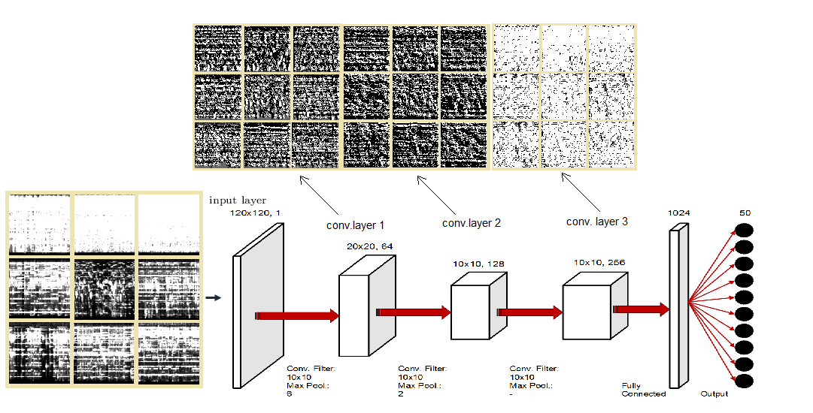
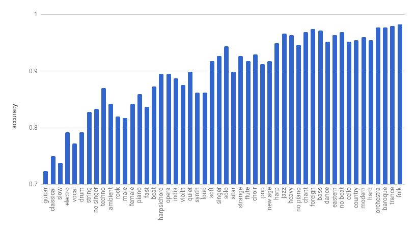
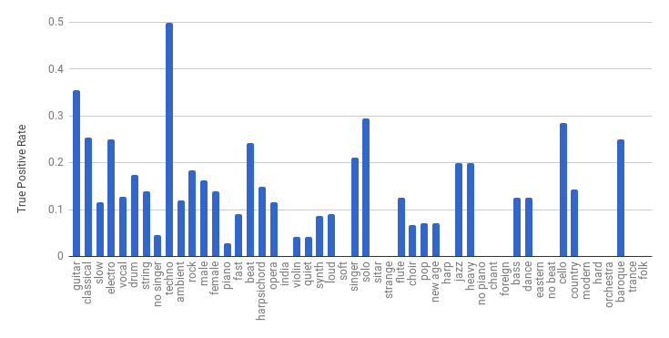
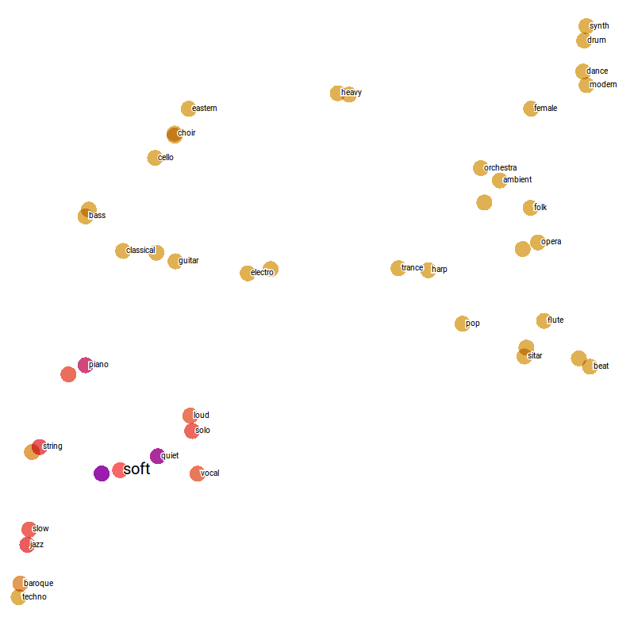

# Development of a Convolutional Neural Network for multi label auto tagging of music audio files

## Initial steps
Download mp3 files and combine them using: cat mp3.zip.* > single_mp3.zip
Extract files from subfolders: find . -mindepth 2 -type f -print -exec mv {} . \;

## Introduction 

In general, music audio files can be accompanied by metadata related to their content such as free text description or tags. Tags are proved to be more useful as they provide a more direct description of the audio file and can be used in tasks such as classification per gender, artist, musical instrument etc in recommendation systems related to music. As not all audio files are accompanied by tags, the need of auto-tagging arises.

One approach widely used involves the usage of unsupervised feature learning such as K-means, sparse coding and Boltzmann machines. In these cases, the main concern is the capture of low leve music structures that can be used as input into some classifier. 

Another approach involves supervised methods, like Deep Neural Networks (DNNs) of various architectural types (MLP, CNN, RNN), that directly map labels to audio files. In these cases, the feature extraction method could vary a lot, from spectograms to hand-engineered features like Mel Frequency Cepstral Coefficients (MFCCs).

In more detail, a spectrogram of an audio clip is a visual representation of its spectrum of frequencies as they vary with time. A common variation is the mel spectrogram, where the so-called mel scale, i.e. a perceptual scale of pitches judged by listeners to be equal in distance from one another, is used. Additionally, MFCCs are coefficients that collectively make up a Mel Frequency Cepstrum (MFC), which is a representation of the short-term power spectrum of a asound, based on a linear cosine transform of a log power spectrum on a nonlinear mel scale of frequency. 

For the purpose of this project, the method that was deployed involves the transformation of the initial sound files into 2D numerical matrices using both feature extraction techniques (mel spectrograms, MFCCs). These matrices were then fed into  a CNN in order to assign suitable tags to each audio clip. Multiple architectures, from shallow to deeper, were evaluated. 

## The dataset 
Among many candidates, the one finally selected was the MagnaTagATune dataset which can be found [here](http://mirg.city.ac.uk/codeapps/the-magnatagatune-dataset). The dataset consists of almost 26000 audio tracks of 29 seconds in mp3 format with 32 mbps, where the 188 available binary tags are not mutually exclusive (i.e. a file can be labeled with more than one tag). The dataset was preferred among all others, since:

- All clips have exactly the same duration 
- All tags are organized in a matrix format with reference to each clip via a unique clip id
- This dataset has already been used successfully in many academic publications
- The dataset is free of copyright protection (DRM licensing) as part of the magnatune music collection

The available tags include, among others music genres (e.g. "pop", "alternative", "indie"), instruments (e.g. "guitar", "violin", "piano"), emotions (e.g. "mellow", "chill") and origins (e.g. "middle eastern", "India"). There are also some tags representing the absence of a characteristic (e.g. "no beat", "no drums")

## Data preprocessing 
### Label reduction
The tags of the original dataset displayed two main dysfunctionalities: synonym tags and extremely skewed tag distributions, i.e. existence of tags with rare occurence. To solve the above issues, in [1_label_reduction_and_files_renaming.py](converters.py) and [aux_label_distribution.py](aux_label_distribution.py), synonym and similar tags were merged into a single tage and eventually the 50 most popular of the merged tags were kept. 

### Feature extraction
For each audio file, the below process was applied:
- Selection of the desirable sampling rate. Uniform sample rates were used to allow easy  batching of the data 
- Selection of the desirable number and type of features (mel spectrogram, MFCCs) to be extracted per sampling window. 
- Extraction of features from the .wav file, i.e. generation of a 2D array where the horizontal axis represents the sampling windows and the vertical axis represents the extracted features. 
- Storage of the above information in numpy array format.

The result of the process is the transformation of the audio wave into a 2D matrix of features. This is displayed in the following figure for three tracks where the frequencies are shown increasing up the vertical axis, time is depicted on the horizontal axis and wave amplitude is represented as color intensity. 

## Methodology
The general idea for the CNN construction was to use the generated 2D numpy arrays as input into a chain of two or three convolutional layers (with or without max pooling), followed by a fully connected layer prior to the class prediction output (multi-hot vectors of 50 positions, one for each tag).

- Activation Function: ReLu
- Loss Function: sigmoid cross entropy with logits
- Optimizer: Adaptive Moment Estimation, i.e. Adam

The finnaly selected architecture is the following:

## Results
As mentioned previously, the auto tagging task is a multi label classification problem. Thus, th ground truth labels provided along with the MagnaTagATune data are encoded as a 50x1 binary vector (multihot vector) where each dimension corresponds to a specific tag. Accordingly, the predictions are also represented as a vector of the same size, but in this case the values are not binary anymore; instead, the represent the probability of that label being assigned to the corresponding audio clip. 
By setting a threshold at 0.5 the final set of labels was acquired.

To assess the network's performance the Receiver Operating Characteristic Curve (AUC) was used which represents the probability that a random classifier will rank a randomly chosen positive instance higher that a randomly chosen negative one. Regarding the Accuracy and True Positive Rate per tag, it was observed that classes with few occurrences display a higher accuracy percentage. This happens due to the high value of True Negatives. In contrast, classes with frequent appearance, such as "guitar", "techno" and "classical", may have a lower accuracy percentage but they are the ones that the network has learnt better, since they have the highest True Positive Rate (Recall).

## Visualizations
As mentioned before, the initial tagging of the clips included in the MagnaTagATune dataset is done by humans. Consequently, in many cases not all appropriate tags were assigned to the corresponding songs. Therefore, for the easier evaluation of the appropriateness of the assigned tags to each audio clip, a visual representation of the tags was constructed. 

Words were represented as vectors with the use of a word to vector model. The word embeddings model was generated with Google News word to vector pre-trained model, comprised of 300 dimensions. The Google News Model is a skip-gram model with negative sampling that is proven to capture a large number of precise syntactic and semantic word relationships. Visualization of music labels in a 2D image required the dimensionality reduction from 300 dimensions to 2. Instead of the Principal Component Analysis (PCA) method, the Distributed Stochastic Neighbor Embedding method (t-SNE) was used. The t-SNE achieves dimensionality reduction by preserving, as much as possible, the original semantic similarity of the tags. 

It should be noted that the cost function used by the method is non-convex while the optimization algorithm is the gradient descent. Thus, different executions of the algorithm would lead to different results. To accomplish a more comprehensive and interactive visualization Tensorflow Projector was used. For this purpose, t-SNE algorithm was implemented twicel; once to reduce Google News model dimensions from 300 to 4 and a second time when Tensorflow Projector was used. 

Studying the produced visualization, it becomes evident that the majority of the semantically close tags are clustered together. Some indicative examples of clusters include: 

- Jazz, slow, soft, quiet, piano, string
- Drum, synth, dance, modern, electro, 
- Orchestra, ambient, harpsichord, harp, violin, flute

To observe more closely the results of the CNN some indicative examples are presented below.

It is identifies that the provided dataset annotations in specific tracks may be insufficient. For example, for clip id 15317 the annotation is "no piano" which provides no information regarding the song itself. This consequently makes training of the CNN more challenging. 

Furthermore, it should be noted that the predicted labels in the majority of cases may be not be 100% accurate but are semantically close to the provided ones. For example, it is evident that in clip id 35334 the annotation "guitar" has been translated to "bass" and "violin" which are all stringed instruments. 

In addition, it is observed that the model predicts suitable tags even in cases where they are not part of the initial annotations, as happens with clip id 24335. 
